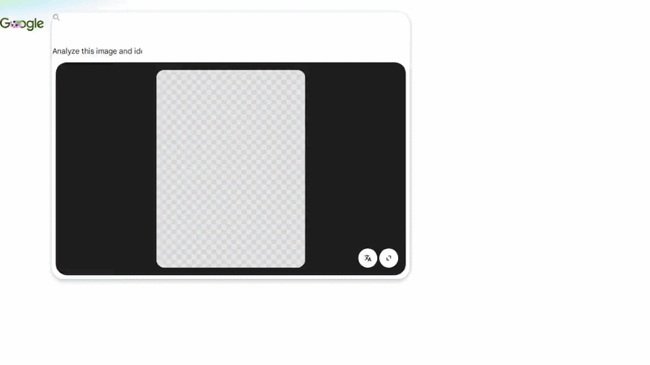

# GLENS — Google Lens Product Identifier



Automated pipeline that uploads images to Google Lens, extracts AI-generated product analysis (titles, brands, prices, sources, dropship viability, social appearances), and outputs structured JSON.

Runs on **GitHub Actions** or locally with Node.js.

---

## What it does

1. **Discovers** images from `./images/` (or other configured directories)
2. **Resizes** them for fast upload (configurable max dimension/quality)
3. **Uploads** to a temporary image host (catbox.moe / litterbox)
4. **Navigates** Google Lens with the image URL + structured prompt
5. **Extracts** the AI response as clean JSON
6. **Records** the entire browser session as an MP4 (optional)
7. **Saves** everything to `./output/`

---

## Quick Start (GitHub Actions)

1. Fork or create a repo with these files:
   ```
   .github/workflows/glens.yml
   glens.js
   images/
   ```

2. Drop your images into `images/`

3. Go to **Actions → GLENS → Run workflow**

4. Download artifacts from the completed run (`glens-output`)

---

## Quick Start (Local)

```bash
# 1. System deps (Ubuntu/Debian)
sudo apt-get update
sudo apt-get install -y ffmpeg libnss3 libxss1 libasound2t64 libatk1.0-0   libatk-bridge2.0-0 libcups2 libgbm1 libxkbcommon-x11-0 libxcomposite1   libxrandr2 libpango-1.0-0 libcairo2 libxdamage1

# 2. Node deps
npm install cloakbrowser puppeteer puppeteer-core mmdb-lib formdata-node sharp

# 3. Install stealth Chromium
npx cloakbrowser install

# 4. Add images
mkdir -p images
# ... copy your images here ...

# 5. Run
export GLENS_MODE=lens
export GLENS_BATCH_SIZE=3
node glens.js
```

---

## Configuration

All settings are controlled via environment variables:

| Variable | Default | Description |
|----------|---------|-------------|
| `GLENS_MODE` | `lens` | `lens` (Google Lens) or `standard` (google.com/ai) |
| `GLENS_BATCH_SIZE` | `3` | Images processed in parallel per batch |
| `GLENS_BATCH_DELAY_MS` | `2000` | Delay between batches |
| `GLENS_SEARCH_DELAY_MS` | `200` | Delay between individual searches (non-batch) |
| `GLENS_NAV_TIMEOUT` | `30000` | Page navigation timeout (ms) |
| `GLENS_RESP_TIMEOUT` | `30000` | Response wait timeout (ms) |
| `GLENS_JSON_IDLE_MS` | `800` | How long JSON must be stable before considered complete |
| `GLENS_UPLOAD_TIMEOUT` | `10000` | Image upload timeout (ms) |
| `GLENS_UPLOAD_RETRIES` | `2` | Upload retry attempts per provider |
| `GLENS_NAV_RETRIES` | `2` | Navigation retry attempts |
| `GLENS_MAX_RETRIES` | `1` | Max image-level retries |
| `GLENS_BACKOFF_BASE_MS` | `300` | Base retry backoff |
| `GLENS_BACKOFF_MAX_MS` | `3000` | Max retry backoff |
| `GLENS_MAX_DIM` | `1024` | Max image dimension for resize |
| `GLENS_QUALITY` | `85` | JPEG quality for resized images |
| `GLENS_SCREENSHOTS` | `false` | Enable screenshots |
| `GLENS_SCREENSHOTS_ERROR_ONLY` | `true` | Only screenshot on errors |
| `GLENS_RECORDING` | `true` | Enable session screen recording |
| `GLENS_RECORDING_FPS` | `12` | Recording framerate |
| `GLENS_RECORDING_QUALITY` | `60` | JPEG quality for frames |
| `GLENS_RECORDING_RES` | `1280x720` | Recording resolution |
| `GLENS_RECORDING_OVERLAY_COLOR` | `#FF0000` | Overlay text color |
| `GLENS_RECORDING_OVERLAY_SIZE` | `16` | Overlay font size |
| `GLENS_OUTPUT_DIR` | `./output` | Output directory |
| `GLENS_SKIP_READY_CHECK` | `true` | Skip image ready check for speed |
| `GLENS_FAST_CLOSE` | `true` | Close browser asynchronously |
| `GLENS_NAV_WAIT` | `domcontentloaded` | Navigation wait condition |
| `GLENS_LOG_LEVEL` | `info` | `debug`, `info`, `warn`, `error` |

---

## Output Structure

```
output/
├── responses/
│   └── ai_responses.json          # Full results + metadata
├── screenshots/
│   ├── lens_1_xxx_loaded.png     # Per-image screenshots (if enabled)
│   ├── lens_1_xxx_lens.png
│   └── ...
└── recordings/
    └── session_YYYY-MM-DD...mp4  # Full session recording (if enabled)
```

### JSON Output Schema

```json
{
  "timestamp": "2026-06-24T17:32:41.147Z",
  "totalImages": 11,
  "successful": 11,
  "failed": 0,
  "withValidJson": 10,
  "blocked": 0,
  "skippedBlocked": 0,
  "rateLimited": 0,
  "mode": "lens",
  "results": [
    {
      "filename": "image.jpg",
      "imageUrl": "https://litter.catbox.moe/...",
      "response": "{"products":[...]}",
      "duration": 12345,
      "error": null,
      "timedOut": false,
      "isBlocked": false,
      "isRateLimited": false,
      "hasJson": true
    }
  ]
}
```

Each `response` contains a `products` array with:
- `title`, `brand`, `description`, `category`
- `price` (current, original, currency)
- `availability`, `sizing`
- `sources` — 5+ direct product URLs (official store → major retailers → resellers)
- `socialAppearances` — Instagram/TikTok/Pinterest posts
- `dropshipViability` — score 1-10 + reasoning + risks
- `estimatedResaleRange` — typical markup range
- `alternatives` — 2-3 cheaper/similar alternatives

---

## How it works

### Batch Processing
Images are processed in parallel batches (default 3). If **any** image in a batch triggers a Google CAPTCHA/block, the entire remaining pipeline is skipped — the IP is burned and further requests will fail.

### Upload Providers
- **Primary:** catbox.moe (permanent, anonymous)
- **Fallback:** litterbox.catbox.moe (72h temporary, anonymous)

Both are free, require no API keys, and work from GitHub Actions runners.

### Screen Recording
A single global MP4 captures the entire session across all browser contexts. Recording stops automatically when:
- All batches complete successfully
- An IP block is detected (early stop to avoid stalling)
- The 30s ffmpeg encoding timeout is hit

### Block Detection
The script detects CAPTCHA, rate limits, and unusual-traffic pages by scanning response text for keywords. Blocked results are flagged but **not retried** — the IP is already flagged.

---

## Troubleshooting

| Issue | Cause | Fix |
|-------|-------|-----|
| `No images found` | `images/` directory empty or wrong path | Add images to `./images/` or edit `IMAGE_DIR_CANDIDATES` |
| `All uploads failed` | Upload services down/changed | Already handled by catbox.moe fallback |
| `IP BLOCKED DETECTED` | Google flagged the runner IP | Wait and retry, or use a different runner/region |
| `0 JSON` | Response didn't contain valid product data | Check `ai_responses.json` raw response for errors |
| Workflow stalls after completion | ffmpeg encoding the session video | Reduced to 30s timeout — will auto-kill if stuck |
| `SyntaxError: Unexpected token '%'` | `%%writefile` from Colab left in file | Ensure first line is `import { launch }` |

---

## Tech Stack

- **Node.js 24** + ES modules
- **Puppeteer** (via CloakBrowser) for stealth automation
- **Sharp** for image resizing
- **ffmpeg** for session video encoding
- **GitHub Actions** `ubuntu-latest` runner

---

## License

MIT — use at your own risk. Google Lens terms apply.
